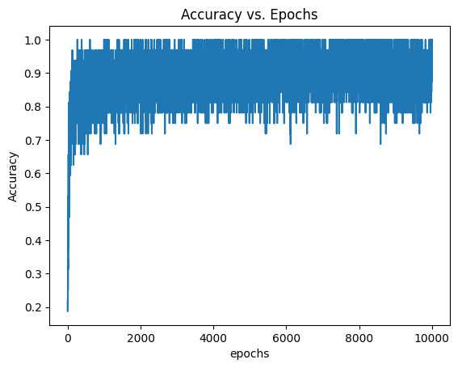

# MNIST-in-cpp
Handwritten digit recognition with c++  

`Matrix.cpp` contains Matrix operations and other utiliy functions  
`Neural_network.cpp` contains `main` function which has training loop  

This is the loss and accuracy I achieved over 10000 epochs  

